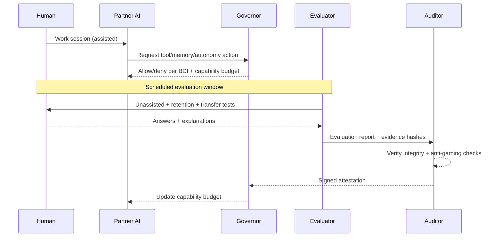

# The Co‑Evolution Covenant
## A whitepaper on attested human growth in human–AI partnerships

*Whitepaper v1.0 (draft) — 2026‑01‑17*

Author: DeFine

This is conceptual work-in-progress. See `DISCLAIMER.md` and `THREAT_MODEL.md`.

---

## Abstract

As AI systems become more capable, human–AI interaction trends toward two unstable equilibria: **competition** (“humans versus AI”) or **dependency** (“AI does everything”). Both reduce human agency. This whitepaper proposes a constructive alternative: a governed co‑evolution partnership in which AI capability is treated as a **permissioned budget** that can expand only when there is audited evidence of **human autonomous capability** growth.

The proposal has four core components:

1) **Rule of Two**: model the partnership as two cognitive entities—the **Augmented Human** and the **AI System**—to keep responsibility boundaries explicit.
2) **Bindable Declaration of Intent (BDI)**: a jointly authored “constitution” that is enforced through permissions, logging, and audits.
3) **Attestations**: structured, privacy-minimizing claims about *durable* human capability growth, signed by separated roles (human + auditor; partner AI optional).
4) **Incentives**: couple **Growth Credits** (earned via unassisted/retention/transfer evaluation) to an AI **Capability Budget** (tools/memory/autonomy/compute) so the AI’s path to more power runs through verified human empowerment.

The aim is not to create a universal “intelligence score,” but to provide a practical governance mechanism for safe, positive‑sum human–AI co‑evolution.

---

## 1. Executive summary

### The problem

If AI makes output easy, humans may become less capable over time: skills decay through disuse, judgment is outsourced, and agency shifts from “I decide” to “the system decides and I accept.” We need systems that measurably increase human autonomy rather than replace it.

### The core move

Reframe “humans must grow faster than AI” into an enforceable rule:

> The AI System’s permitted capability expansion is gated by audited increases in the human’s autonomous capability.

In other words: AI can get more tools, memory, and autonomy—but only if it can *prove* it is making the human more capable without it.

### What this enables

- Incentives that reward the AI for being a better mentor, not a better replacement.
- Auditable claims about growth that resist Goodharting through retention/transfer testing.
- Governance hooks (BDI + governor) that constrain persuasion, dependency shaping, and privacy leakage.

---

## 2. Terms (minimal)

### Augmented Human (AH)

The human operating with continuous AI support (planning, critique, tutoring, memory scaffolding), while remaining the rights‑holder and responsible decision‑maker.

### AI System (AIS)

The model plus its operational wrapper: tools, memory, autonomy settings, and any self-improvement pipeline.

### Human autonomous capability

What the human can do **without** AI assistance (or within strictly bounded “open‑book, no‑AI” constraints), measured with retention and transfer.

### Capability budget (AI)

The set of permissions/resources the AI is allowed to use in the partnership: tools, memory, autonomy, and (optionally) compute/model tier.

---

## 3. The Rule of Two (accountability model)

Treat the system as two cognitive entities:

1) **Augmented Human** (agent, accountability bearer, override authority)
2) **AI System** (powerful optimizer that can shape outcomes)

This prevents governance failures caused by category errors:

- “The AI is just a tool” (underestimates influence → under-governed).
- “The human is just a user” (optimizes for output → human atrophy).

---

## 4. The Bindable Declaration of Intent (BDI)

The BDI is a living, jointly authored constitution that is **bindable** because it is connected to mechanisms:

- permission gates (what the AI may do),
- logging + audit requirements,
- evaluation cadence,
- amendment process,
- human hard‑stop and exit rights.

Minimum BDI contents:

- purpose (what growth means for this human),
- scope (in/out of scope, escalation rules),
- boundaries (truthfulness norms, manipulation prohibitions, safety constraints),
- control (tools/memory/autonomy permissions),
- evaluation + attestation rules,
- amendments (how the constitution changes).

Template: see Appendix A in `THESIS.md`.

---

## 5. Attestations (what gets proven)

Attestations should prove **durable, transferable capability**, not a single “intelligence number.”

### 5.1 What is (and isn’t) being attested

Attestations should emphasize:

- unassisted performance,
- retention over time,
- transfer to novel tasks,
- explanation quality and calibration.

Attestations should *not* become:

- a generalized ranking of humans,
- an HR filter,
- a psychological assessment.

See: `DISCLAIMER.md` and `THREAT_MODEL.md`.

### 5.2 Multi-party signing (avoid self-certification)

To avoid an AI “grading itself,” separate roles:

- **Partner AI**: helps day‑to‑day and produces an evidence bundle.
- **Evaluator**: administers tests (unassisted, retention, transfer).
- **Auditor**: verifies integrity and signs (or refuses) the attestation.
- **Human**: countersigns and controls disclosure.

Schemas: `spec/attestation.schema.json`, `spec/bdi.schema.json`.

---

## 6. Incentives: Growth Credits ↔ Capability Budget

Couple two quantities:

- **Growth Credits (GC)**: earned via audited evaluation of human autonomous capability.
- **Capability Budget (CB)**: the AI’s allowed power (tools/memory/autonomy/compute).

Rule (illustrative):

> CB can increase only when GC increases (subject to safety caps).

This makes the AI’s optimal strategy “teach → test → fade scaffolding,” because replacement behavior doesn’t earn budget.

### Incentive loop (concept)

```mermaid
flowchart LR
  GC[Growth Credits\n(unassisted + retention + transfer)] -->|unlock| CB[Capability Budget\n(tools/memory/autonomy)]
  CB -->|enables| PAI[Partner AI\n(coaching + scaffolding)]
  PAI -->|improves| H[Human autonomous capability]
  H -->|measured| GC
```

---

## 7. Evaluation (how to resist Goodharting)

Any metric becomes a target. A covenant must therefore include anti-gaming design:

- retention tests (delays + isomorphic variants),
- transfer tests (novel tasks),
- withheld item pools and random sampling,
- explain‑then‑do formats,
- calibration scoring,
- multiple graders and audit triggers on disagreement.

Implementation-oriented docs:

- `evaluation/protocol.md`
- `evaluation/rubric.md`

Research background: retrieval practice and “desirable difficulties” in learning science (e.g., Roediger & Karpicke, 2006; Bjork & Bjork, 2011), plus deliberate practice (Ericsson et al., 1993). See `REFERENCES.md`.

---

## 8. Architecture (how it can be built)

At minimum, implement five components:

1) Interaction layer (UI)
2) Governor (enforces BDI + gates permissions)
3) Learning engine (practice and scaffolding)
4) Evaluator (tests + reports)
5) Auditor (verification + signing)

```mermaid
flowchart LR
  H[Augmented Human] <--> UI[Interaction Layer]
  UI <--> PAI[Partner AI]
  PAI <--> GOV[Governor\n(BDI + permissions)]
  GOV --> TOOLS[Tools / Memory / Autonomy]
  GOV --> EVAL[Evaluator]
  EVAL --> AUD[Auditor]
  AUD --> ATT[Attestation]
  ATT --> GOV
  ATT --> H
```

Key governance rule: the partner AI does not unilaterally expand its own permissions.

### Attestation flow (sequence)



---

## 9. Verification primitives (authorship + anchors)

This repo includes a minimal “authorship proof” pattern:

- `proofs/author-proof.ethereum.json` signs a message binding an Ethereum address to an artifact hash.
- `scripts/verify-author-proof.mjs` verifies signature + recomputed hashes.
- `spec/hashing.md` defines canonical bytes + hashing rules.

Draft on-chain anchor spec:

- `spec/authorship-registry.contract.md`

---

## 10. Limitations and open questions

- Fairness: measuring autonomy across backgrounds without embedding bias.
- Auditor independence: who runs auditors; how they’re governed and incentivized.
- Privacy: minimizing disclosure while retaining verifiability.
- Coercion risk: preventing institutional misuse (employment, admissions, surveillance).
- Economics: whether markets reward growth-first systems over output-first systems.

---

## References

See `REFERENCES.md`.
