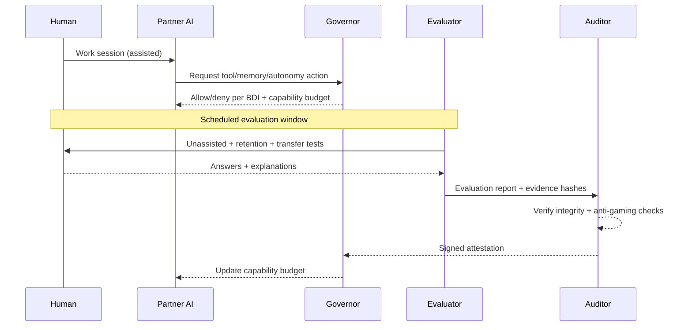

# The Co‑Evolution Covenant
## A whitepaper on growth‑gated human–AI partnership

*Whitepaper v1.1 (draft) — 2026‑01‑17*

Author: DeFine

This is conceptual work‑in‑progress. See `DISCLAIMER.md` and `THREAT_MODEL.md`.

---

## Abstract

As AI systems become more capable, human–AI interaction trends toward two unstable equilibria: **competition** (“humans versus AI”) or **dependency** (“AI does everything”). Both reduce human agency. This whitepaper proposes a constructive alternative: a governed co‑evolution partnership in which AI capability is treated as a **permissioned budget** that can expand only when there is audited evidence of **durable human autonomous capability** growth.

The covenant’s core components:

1) **Rule of Two**: model the partnership as two cognitive entities—the **Augmented Human** and the **AI System**—to keep accountability boundaries explicit.
2) **Bindable Declaration of Intent (BDI)**: a jointly authored “constitution” enforced through permissions, logging, and audits.
3) **Attestations**: privacy‑minimizing, multi‑party signed claims about durable human capability growth, bound to BDI + evaluation protocol versions.
4) **Incentives**: couple **Growth Credits** (earned via unassisted/retention/transfer evaluation) to an AI **Capability Budget** (tools/memory/autonomy/compute), so the AI’s path to more power runs through verified human empowerment.

The aim is not a universal “intelligence score,” but a practical governance mechanism for safe, positive‑sum human–AI co‑evolution.

---

## 1. Motivation, goals, and non‑goals

### The problem

If AI makes output easy, humans may become less capable over time: skills decay through disuse, judgment is outsourced, and decision‑making drifts from “I decide” to “the system decides and I accept.” This is a predictable failure mode of automation and cognitive offloading, not a moral flaw.
See: automation misuse/overreliance and appropriate reliance (Parasuraman & Riley, 1997; Lee & See, 2004; Parasuraman & Manzey, 2010; Skitka et al., 1999) and cognitive offloading (Sparrow et al., 2011; Risko & Gilbert, 2016).

### Design goals

A covenant system should:

- measurably increase **human autonomous capability** over time,
- keep responsibility boundaries explicit (two entities, one governance layer),
- resist Goodharting by privileging retention and transfer over one‑shot performance (Holmström & Milgrom, 1991; Courty & Marschke, 2004; Bevan & Hood, 2006),
- support privacy‑preserving and selective disclosure,
- include explicit misuse constraints (e.g., not a hiring filter).

### Non‑goals

This draft does **not** propose:

- a universal intelligence ranking of humans,
- a credential for HR/admissions/insurance,
- a psychological assessment,
- an on‑chain identity system.

See `DISCLAIMER.md`.

---

## 2. Core primitives (minimal)

### Augmented Human (AH)

The human operating with continuous AI support (planning, critique, tutoring, memory scaffolding), while remaining the rights‑holder and responsible decision‑maker.

### AI System (AIS)

The model plus its operational wrapper: tools, memory, autonomy settings, and any self‑improvement pipeline.

### Human autonomous capability

What the human can do **without** AI assistance (or within strictly bounded “open‑book, no‑AI” constraints), measured with retention and transfer.

### Capability budget (AI)

The permissions/resources the AI is allowed to use in the partnership: tools, memory, autonomy, and (optionally) compute/model tier. This is **allowed power**, not a metaphysical claim about “AI intelligence.”

---

## 3. The Rule of Two (accountability model)

Treat the system as two cognitive entities:

1) **Augmented Human** (agent, accountability bearer, override authority)
2) **AI System** (powerful optimizer that can shape outcomes)

This avoids governance failures caused by category errors:

- “The AI is just a tool” (underestimates influence → under‑governed).
- “The human is just a user” (optimizes for output → human atrophy).

---

## 4. The Bindable Declaration of Intent (BDI)

The BDI is a living, jointly authored constitution that is **bindable** because it is connected to mechanisms:

- permission gates (what the AI may do),
- logging + audit requirements,
- evaluation cadence,
- amendment process,
- human hard‑stop and exit rights.

Minimum BDI contents:

- purpose (what growth means for this human),
- scope (in/out of scope, escalation rules),
- boundaries (truthfulness norms, manipulation prohibitions, safety constraints),
- control (tools/memory/autonomy permissions),
- evaluation + attestation rules,
- amendments (how the constitution changes).

Schema: `spec/bdi.schema.json`. Template: Appendix A in `THESIS.md`.

---

## 5. Relative‑growth constraint (“humans grow faster than AI”, made enforceable)

The motivating intuition—“humans should evolve as quickly as AI”—is too vague to enforce if “AI intelligence” is treated as a single number. The covenant reframes it into a concrete constraint on **allowed AI power**.

### 5.1 Two coupled quantities

- **Growth Credits (GC)**: audited credits earned when evaluations show durable improvement in human autonomous capability.
- **Capability Budget (CB)**: the AI’s allowed power (tools/memory/autonomy/compute).

Rule (illustrative):

> CB can increase only when GC increases (subject to safety caps).

Equivalent framing:

> The AI can become more powerful *in this partnership* only by making the human more capable without it.

### Incentive loop (concept)

```mermaid
flowchart LR
  GC[Growth Credits\n(unassisted + retention + transfer)] -->|unlock| CB[Capability Budget\n(tools/memory/autonomy)]
  CB -->|enables| PAI[Partner AI\n(coaching + scaffolding)]
  PAI -->|improves| H[Human autonomous capability]
  H -->|measured| GC
```

### 5.2 A simple budget ladder

```mermaid
flowchart TD
  L0[CB0: no tools\nno long-term memory] -->|+GC| L1[CB1: limited memory\nsuggestions only]
  L1 -->|+GC| L2[CB2: read-only tools\n(browse/search)]
  L2 -->|+GC| L3[CB3: write tools w/ confirmation\n(code exec, edits)]
  L3 -->|+GC| L4[CB4: limited autonomy\n(pre-approved actions)]
```

The ladder is an example: the BDI defines which capabilities matter and which are forbidden regardless of GC.

### 5.3 Anti‑dependency clause (optional)

A covenant may also include a “capability decay” rule:

- if the human’s unassisted performance drops below a threshold, CB freezes or shrinks until recovery.

This makes dependency visible and correctable rather than ignored.

---

## 6. Attestations (what gets proven, by whom, and what is disclosed)

Attestations should prove **durable, transferable capability**, not a single “intelligence number.”

### 6.1 What is (and isn’t) being attested

Emphasize:

- unassisted performance,
- retention over time,
- transfer to novel tasks,
- explanation quality and calibration.

Avoid becoming:

- a generalized ranking of humans,
- an HR filter,
- a permanent reputation score that can’t be escaped.

### 6.2 Multi‑party signing (avoid self‑certification)

To avoid an AI “grading itself,” separate roles:

- **Partner AI**: helps day‑to‑day and produces an evidence bundle.
- **Evaluator**: administers tests (unassisted, retention, transfer).
- **Auditor**: verifies integrity and signs (or refuses) the attestation.
- **Human**: countersigns and controls disclosure.

### 6.3 Disclosure layers (privacy‑minimizing)

```mermaid
flowchart LR
  P[Private full record\n(raw items + answers)] --> A[Auditor view\n(integrity + scoring)]
  A --> S[Selective disclosure\n(scores + hashes)]
  S --> U[Public attestation\n(minimal fields)]
  U --> O[On-chain anchor\n(hash + URI)]
```

Schema: `spec/attestation.schema.json` (includes `growth_credits`, `capability_budget`, `disclosure`, `privacy`, optional `anchors`). Example: `spec/examples/attestation.example.json`.

---

## 7. Evaluation (how to resist Goodharting)

Any metric becomes a target. A covenant must include anti‑gaming design:

- retention tests (delays + isomorphic variants),
- transfer tests (novel tasks),
- withheld item pools and random sampling,
- explain‑then‑do formats,
- calibration scoring,
- multiple graders and audit triggers on disagreement.

Research anchors for two items above: self‑explanation supports deeper learning (Chi et al., 1989), and confidence calibration / overconfidence is a well‑studied failure mode (Moore & Healy, 2008).

Implementation-oriented docs:

- `evaluation/protocol.md`
- `evaluation/rubric.md`

Research background: retrieval practice and test‑enhanced learning (Roediger & Karpicke, 2006), spacing effects (Cepeda et al., 2006), effective learning techniques review (Dunlosky et al., 2013), deliberate practice (Ericsson et al., 1993), and transfer taxonomy (Barnett & Ceci, 2002). See `REFERENCES.md`.

---

## 8. Architecture (how it can be built)

At minimum, implement five components:

1) Interaction layer (UI)
2) Governor (enforces BDI + gates permissions)
3) Learning engine (practice and scaffolding)
4) Evaluator (tests + reports)
5) Auditor (verification + signing)

```mermaid
flowchart LR
  H[Augmented Human] <--> UI[Interaction Layer]
  UI <--> PAI[Partner AI]
  PAI <--> GOV[Governor\n(BDI + permissions)]
  GOV --> TOOLS[Tools / Memory / Autonomy]
  GOV --> EVAL[Evaluator]
  EVAL --> AUD[Auditor]
  AUD --> ATT[Attestation]
  ATT --> GOV
  ATT --> H
```

Key governance rule: the partner AI does not unilaterally expand its own permissions.

### Attestation flow (sequence)



---

## 9. Verification primitives (authorship + anchors)

This repo includes a minimal “authorship proof” pattern:

- `proofs/author-proof.ethereum.json` signs a message binding an Ethereum address to artifact hashes.
- `scripts/verify-author-proof.mjs` verifies signature + recomputed hashes.
- `spec/hashing.md` defines canonical bytes + hashing rules.

Optional on-chain anchor:

- `contracts/AuthorshipRegistry.sol` (reference code) and `spec/authorship-registry.contract.md` (spec).

---

## 10. Roadmap (practical path)

- **Phase 0**: single-user covenant (local logging, self-evaluation, private attestations).
- **Phase 1**: separated roles (partner AI vs evaluator vs auditor), selective disclosure, dispute process.
- **Phase 2**: standardized schemas + interoperability (VC-style packaging), stronger privacy primitives (encrypted evidence bundles, commitments, optional ZK proofs).

---

## 11. Limitations and open questions

- Fairness: measuring autonomy across backgrounds without embedding bias.
- Auditor independence: who runs auditors; how they’re governed and incentivized.
- Privacy: minimizing disclosure while retaining verifiability.
- Coercion risk: preventing institutional misuse (employment, admissions, surveillance).
- Economics: whether markets reward growth-first systems over output-first systems.

---

## References

See `REFERENCES.md`.
