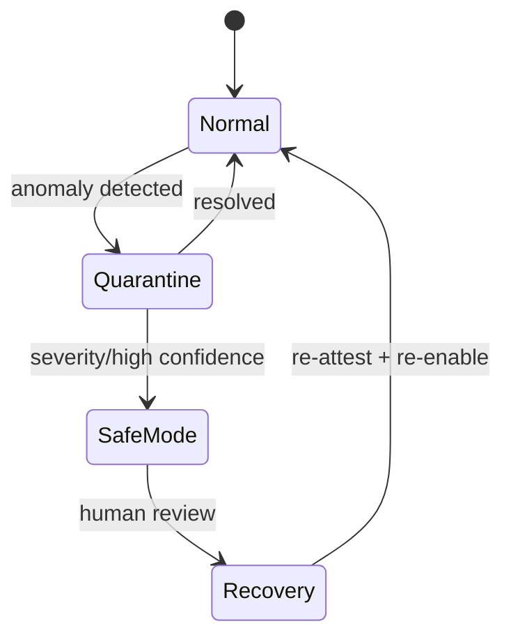
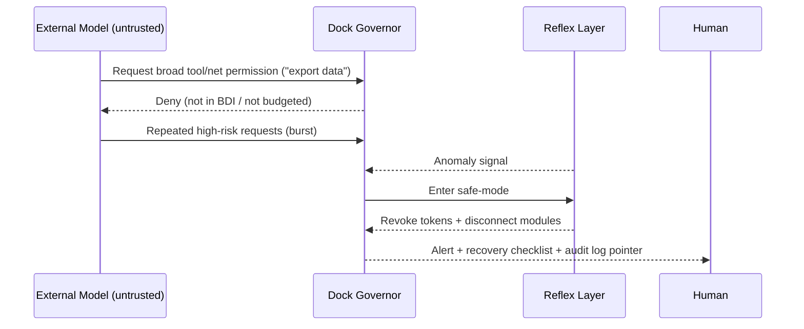
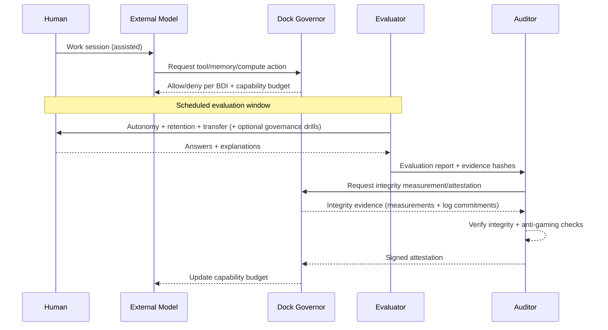

# The Co‑Evolution Covenant
## A whitepaper on growth‑gated human–AI partnership

*Whitepaper v1.2 (draft) — 2026‑01‑17*

Author: DeFine

This is conceptual work‑in‑progress. See `DISCLAIMER.md` and `THREAT_MODEL.md`.

---

## Abstract

As AI systems become more capable, human–AI interaction trends toward two unstable equilibria: **competition** (“humans versus AI”) or **dependency** (“AI does everything”). Both reduce human agency. This whitepaper proposes a constructive alternative: a governed co‑evolution partnership in which AI capability is treated as a **permissioned budget** that can expand only when there is audited evidence of **durable human autonomous capability** growth.

The covenant’s core components:

1) **Rule of Two**: model the partnership as two cognitive entities—the **Augmented Human** and the **AI System**—to keep accountability boundaries explicit.
2) **Bindable Declaration of Intent (BDI)**: a jointly authored “constitution” enforced through permissions, logging, and audits.
3) **Attestations**: privacy‑minimizing, multi‑party signed claims about durable human capability growth, bound to BDI + evaluation protocol versions.
4) **Incentives**: couple **Growth Credits** (earned via unassisted/retention/transfer evaluation) to an AI **Capability Budget** (tools/memory/autonomy/compute), so the AI’s path to more power runs through verified human empowerment.

The aim is not a universal “intelligence score,” but a practical governance mechanism for safe, positive‑sum human–AI co‑evolution.

---

## 1. Motivation, goals, and non‑goals

### The problem

If AI makes output easy, humans may become less capable over time: skills decay through disuse, judgment is outsourced, and decision‑making drifts from “I decide” to “the system decides and I accept.” This is a predictable failure mode of automation and cognitive offloading, not a moral flaw.
See: automation misuse/overreliance and appropriate reliance (Parasuraman & Riley, 1997; Lee & See, 2004; Parasuraman & Manzey, 2010; Skitka et al., 1999) and cognitive offloading (Sparrow et al., 2011; Risko & Gilbert, 2016).

### Design goals

A covenant system should:

- measurably increase **human autonomous capability** over time,
- keep responsibility boundaries explicit (two entities, one governance layer),
- resist Goodharting by privileging retention and transfer over one‑shot performance (Holmström & Milgrom, 1991; Courty & Marschke, 2004; Bevan & Hood, 2006),
- support privacy‑preserving and selective disclosure,
- include explicit misuse constraints (e.g., not a hiring filter).

### Non‑goals

This draft does **not** propose:

- a universal intelligence ranking of humans,
- a credential for HR/admissions/insurance,
- a psychological assessment,
- an on‑chain identity system.

See `DISCLAIMER.md`.

---

## 2. Core primitives (minimal)

### Augmented Human (AH)

The human operating with continuous AI support (planning, critique, tutoring, memory scaffolding), while remaining the rights‑holder and responsible decision‑maker.

### AI System (AIS)

The model plus its operational wrapper: tools, memory, autonomy settings, and any self‑improvement pipeline.

### Human autonomous capability

What the human can do **without** AI assistance (or within strictly bounded “open‑book, no‑AI” constraints), measured with retention and transfer.

### Capability budget (AI)

The permissions/resources the AI is allowed to use in the partnership: tools, memory, autonomy, and (optionally) compute/model tier. This is **allowed power**, not a metaphysical claim about “AI intelligence.”

---

## 3. The Rule of Two (accountability model)

Treat the system as two cognitive entities:

1) **Augmented Human** (agent, accountability bearer, override authority)
2) **AI System** (powerful optimizer that can shape outcomes)

This avoids governance failures caused by category errors:

- “The AI is just a tool” (underestimates influence → under‑governed).
- “The human is just a user” (optimizes for output → human atrophy).

---

## 4. The Bindable Declaration of Intent (BDI)

The BDI is a living, jointly authored constitution that is **bindable** because it is connected to mechanisms:

- permission gates (what the AI may do),
- logging + audit requirements,
- evaluation cadence,
- amendment process,
- human hard‑stop and exit rights.

Minimum BDI contents:

- purpose (what growth means for this human),
- scope (in/out of scope, escalation rules),
- boundaries (truthfulness norms, manipulation prohibitions, safety constraints),
- control (tools/memory/autonomy permissions),
- evaluation + attestation rules,
- amendments (how the constitution changes).

Schema: `spec/bdi.schema.json`. Template: Appendix A in `THESIS.md`.

---

## 5. Relative‑growth constraint (“humans grow faster than AI”, made enforceable)

The motivating intuition—“humans should evolve as quickly as AI”—is too vague to enforce if “AI intelligence” is treated as a single number. The covenant reframes it into a concrete constraint on **allowed AI power**.

### 5.1 Two coupled quantities

- **Growth Credits (GC)**: audited credits earned when evaluations show durable improvement in human autonomous capability.
- **Capability Budget (CB)**: the AI’s allowed power (tools/memory/autonomy/compute).

Rule (illustrative):

> CB can increase only when GC increases (subject to safety caps).

Equivalent framing:

> The AI can become more powerful *in this partnership* only by making the human more capable without it.

### Incentive loop (concept)

```mermaid
flowchart LR
  GC[Growth Credits\n(unassisted + retention + transfer)] -->|unlock| CB[Capability Budget\n(tools/memory/autonomy)]
  CB -->|enables| PAI[Partner AI\n(coaching + scaffolding)]
  PAI -->|improves| H[Human autonomous capability]
  H -->|measured| GC
```

### 5.2 A simple budget ladder

```mermaid
flowchart TD
  L0[CB0: no tools\nno long-term memory] -->|+GC| L1[CB1: limited memory\nsuggestions only]
  L1 -->|+GC| L2[CB2: read-only tools\n(browse/search)]
  L2 -->|+GC| L3[CB3: write tools w/ confirmation\n(code exec, edits)]
  L3 -->|+GC| L4[CB4: limited autonomy\n(pre-approved actions)]
```

The ladder is an example: the BDI defines which capabilities matter and which are forbidden regardless of GC.

### 5.3 Anti‑dependency clause (optional)

A covenant may also include a “capability decay” rule:

- if the human’s unassisted performance drops below a threshold, CB freezes or shrinks until recovery.

This makes dependency visible and correctable rather than ignored.

---

## 6. Attestations (what gets proven, by whom, and what is disclosed)

Attestations should prove **durable, transferable capability**, not a single “intelligence number.”

### 6.1 What is (and isn’t) being attested

Emphasize:

- unassisted performance,
- retention over time,
- transfer to novel tasks,
- explanation quality and calibration.

Avoid becoming:

- a generalized ranking of humans,
- an HR filter,
- a permanent reputation score that can’t be escaped.

### 6.2 Multi‑party signing (avoid self‑certification)

To avoid an AI “grading itself,” separate roles:

- **Partner AI**: helps day‑to‑day and produces an evidence bundle.
- **Evaluator**: administers tests (unassisted, retention, transfer).
- **Auditor**: verifies integrity and signs (or refuses) the attestation.
- **Human**: countersigns and controls disclosure.

### 6.3 Disclosure layers (privacy‑minimizing)

```mermaid
flowchart LR
  P[Private full record\n(raw items + answers)] --> A[Auditor view\n(integrity + scoring)]
  A --> S[Selective disclosure\n(scores + hashes)]
  S --> U[Public attestation\n(minimal fields)]
  U --> O[On-chain anchor\n(hash + URI)]
```

Schema: `spec/attestation.schema.json` (includes `growth_credits`, `capability_budget`, `disclosure`, `privacy`, optional `anchors`). Example: `spec/examples/attestation.example.json`.

---

## 7. Evaluation (how to resist Goodharting)

Any metric becomes a target. A covenant must include anti‑gaming design:

- retention tests (delays + isomorphic variants),
- transfer tests (novel tasks),
- withheld item pools and random sampling,
- explain‑then‑do formats,
- calibration scoring,
- optional governance/supervisory drills under high automation,
- multiple graders and audit triggers on disagreement.

Research anchors: self‑explanation supports deeper learning (Chi et al., 1989), confidence calibration / overconfidence is a well‑studied failure mode (Moore & Healy, 2008), and high automation can create out‑of‑the‑loop failures that motivate governance drills (Bainbridge, 1983; Endsley, 1995; Endsley & Kiris, 1995).

Implementation-oriented docs:

- `evaluation/protocol.md`
- `evaluation/rubric.md`

Research background: retrieval practice and test‑enhanced learning (Roediger & Karpicke, 2006), spacing effects (Cepeda et al., 2006), effective learning techniques review (Dunlosky et al., 2013), deliberate practice (Ericsson et al., 1993), and transfer taxonomy (Barnett & Ceci, 2002). See `REFERENCES.md`.

---

## 8. Architecture (how it can be built)

At minimum, implement five components:

1) Interaction layer (UI)
2) Governor (enforces BDI + gates permissions)
3) Learning engine (practice and scaffolding)
4) Evaluator (tests + reports)
5) Auditor (verification + signing)

```mermaid
flowchart LR
  H[Augmented Human] <--> UI[Interaction Layer]
  UI <--> PAI[Partner AI]
  PAI <--> GOV[Governor\n(BDI + permissions)]
  GOV --> TOOLS[Tools / Memory / Autonomy]
  GOV --> EVAL[Evaluator]
  EVAL --> AUD[Auditor]
  AUD --> ATT[Attestation]
  ATT --> GOV
  ATT --> H
```

Key governance rule: the partner AI does not unilaterally expand its own permissions.

### 8.1 Dockable Symbiosis: trusted dock core + swappable inference modules

One practical way to keep the human in control *without* imposing constant per‑output verification overhead is to separate the system into:

- a **trusted dock core** (always‑on “cognitive OS” + compute), and
- **swappable inference modules** (external models treated as replaceable co‑processors).

In this variant, the dock core is “more capable” by design: it holds the BDI/policy, keys, memory store, logging, and the tool/compute plane that the human relies on continuously. External models only receive IO through the dock and cannot directly act, persist memory, or expand permissions.

This architecture is motivated by two constraints:

1) **Human reaction time is too slow** for concurrent, fast‑moving failures. Classic work on automation and situation awareness highlights that when systems are highly automated, operators can be out‑of‑the‑loop and least able to intervene precisely when intervention is most needed (Bainbridge, 1983; Endsley, 1995; Endsley & Kiris, 1995; Parasuraman et al., 2000).
2) **“Compliance” is best enforced structurally**, not assumed behaviorally. Systems security work emphasizes least privilege and complete mediation: every access to sensitive resources should be checked by a small, trustworthy reference monitor (Saltzer & Schroeder, 1975). Smaller enforcement cores are also more amenable to high‑assurance techniques, including comprehensive formal verification (Klein et al., 2014). Capability‑oriented designs reduce ambient authority and confused‑deputy style failures (Dennis & Van Horn, 1966; Hardy, 1988).

High-level sketch:

```mermaid
flowchart LR
  H[Human] <--> DOCK[Dock Core\n(BDI + governor + logs + keys)]
  DOCK --> CP[Compute Plane\n(local tools + sandboxed execution)]
  DOCK --> PB[Perception Bus\n(real-time utilities)]
  DOCK <--> M1[External Model A\n(untrusted module)]
  DOCK <--> M2[External Model B\n(untrusted module)]
  CP --> OUT[Effects\n(files/network/actions)]
```

Implementation notes (research‑anchored):

- Use **bounded capability tokens** (scope + budget + duration + revocation), not “general permits,” to prevent privilege escalation via IO tricks (Saltzer & Schroeder, 1975; Hardy, 1988).
- Keep untrusted components sandboxed/compartmentalized (e.g., fault isolation) so compromise is contained (Wahbe et al., 1993).
- Prefer a **small, high‑assurance enforcement core**: small reference monitors are more amenable to strong assurance methods, including comprehensive formal verification in microkernel‑scale systems (Klein et al., 2014).
- Prefer **integrity measurement and attestation** of the running dock core (what code/policy is actually executing) so users can trust the boundary rather than re‑verifying every output (Garfinkel et al., 2003; Shi et al., 2005; Jaeger et al., 2006; McCune et al., 2010). Proof‑carrying approaches show how “untrusted code” can be paired with verifiable safety evidence (Necula, 1997), and inlined reference monitors show policy enforcement techniques for untrusted runtimes (Erlingsson & Schneider, 2000).

### 8.2 Dock core invariants (permissioned compute + audited effects)

Dockable Symbiosis only works if the dock is treated as a real security boundary. A practical design targets these invariants:

- **Complete mediation**: every side effect (file writes, network calls, key use, long‑term memory mutation) is mediated by the dock governor (Saltzer & Schroeder, 1975).
- **No ambient authority**: external modules never inherit “whatever the dock can do.” They receive revocable, scoped capability tokens only (Hardy, 1988).
- **No direct persistence**: external modules cannot write to long‑term memory/logs; they can only propose changes for the dock to apply after policy checks.
- **Compute as a governed resource**: “raw compute” lives inside the dock’s compute plane, so high‑power tools (including local models) are still bound by the same budgets and logging rules.
- **Tamper‑evident audit trail**: decisions and effects are logged so auditors can verify enforcement after the fact (see “integrity measurement and attestation” above).

### 8.3 Reflex layer (fast defensive path)

Even with good UI, operators can be out‑of‑the‑loop in high‑automation regimes and struggle to intervene under time pressure (Bainbridge, 1983; Endsley, 1995; Endsley & Kiris, 1995; Parasuraman et al., 2000). A dock therefore needs a “reflex layer”: a fast, always‑on defensive path that can restrict capabilities without waiting for the human to notice.

Typical reflex behaviors:

- Rate limiting and budget enforcement on tool/compute requests.
- Automatic quarantine when anomaly detectors fire (e.g., sudden bursts of high‑risk tool requests, repeated attempts to obtain broader permissions).
- Safe‑mode entry that (a) disconnects external modules, (b) revokes active capability tokens, and (c) freezes high‑risk tools until human review.



### 8.4 Perception bus (real-time utilities)

Some use cases require real‑time “seeing” and utilities (vision, audio, screen context). The dock can support this without giving external modules raw, continuous access by introducing a **perception bus**:

- Default to **derived, low‑bandwidth features** (captions, OCR, object labels, structured state) rather than raw sensor streams.
- Require explicit, time‑boxed capability tokens for any raw streaming (“camera for 30s to region X”) and keep a persistent UI indicator while active.
- Run perception utilities locally inside the dock’s compute plane so outputs and side effects remain governed and logged.

### 8.5 Worked scenario: containing a rogue external module

Scenario: an untrusted external module attempts to escalate privileges by repeatedly requesting broader access (or by embedding tool-like instructions in its output). In Dockable Symbiosis, escalation attempts are handled structurally:



The promise is not that untrusted modules “won’t deceive,” but that deception cannot directly become action without passing the dock’s mediated, logged, budgeted gates.

### 8.6 Attestation flow (sequence)



---

## 9. Verification primitives (authorship + anchors)

This repo includes a minimal “authorship proof” pattern:

- `proofs/author-proof.ethereum.json` signs a message binding an Ethereum address to artifact hashes.
- `scripts/verify-author-proof.mjs` verifies signature + recomputed hashes.
- `spec/hashing.md` defines canonical bytes + hashing rules.

Optional on-chain anchor:

- `contracts/AuthorshipRegistry.sol` (reference code) and `spec/authorship-registry.contract.md` (spec).

---

## 10. Roadmap (practical path)

- **Phase 0**: single-user covenant (local logging, self-evaluation, private attestations).
- **Phase 1**: separated roles (partner AI vs evaluator vs auditor), selective disclosure, dispute process.
- **Phase 2**: standardized schemas + interoperability (VC-style packaging), stronger privacy primitives (encrypted evidence bundles, commitments, optional ZK proofs).

---

## 11. Limitations and open questions

- Fairness: measuring autonomy across backgrounds without embedding bias.
- Auditor independence: who runs auditors; how they’re governed and incentivized.
- Privacy: minimizing disclosure while retaining verifiability.
- Coercion risk: preventing institutional misuse (employment, admissions, surveillance).
- Economics: whether markets reward growth-first systems over output-first systems.

---

## References

See `REFERENCES.md`.
